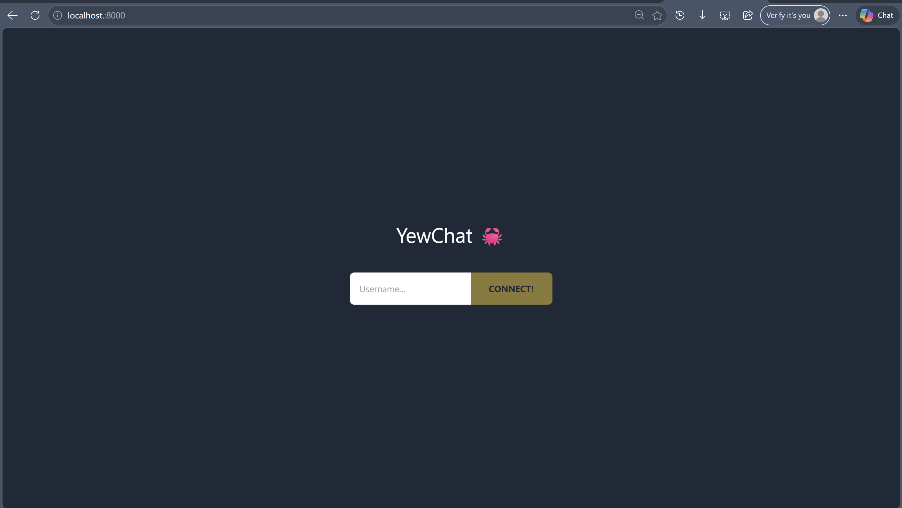
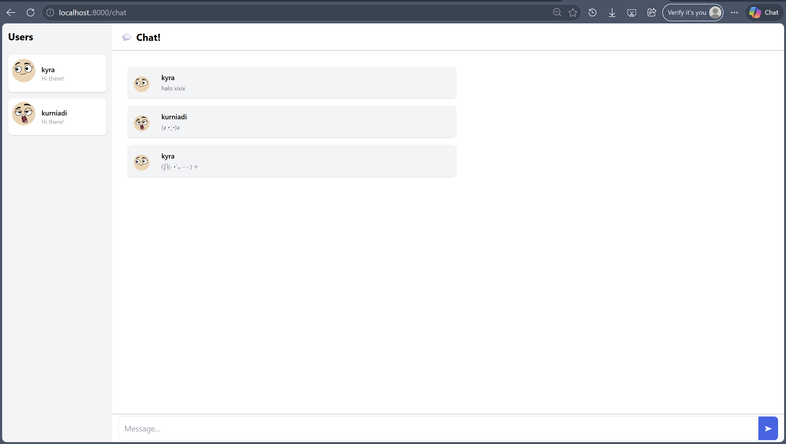
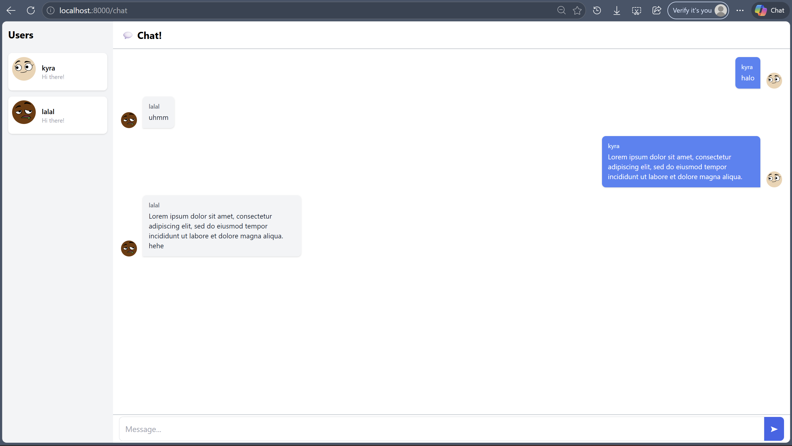

# Tutorial 10 Asynchronous Programming (Bagian 3)

### Experiment 3.1: Original code YewChat

#### Cara menjalankan:
1. Jalankan WebSocket server:
```
cd SimpleWebsocketServer
npm start
```
2. Jalankan YewChat frontend:
```
cd YewChat
trunk serve --port 8000
```

3. Buka browser ke http://localhost:8000

#### Hasil:





YewChat adalah aplikasi web chat yang dibangun menggunakan Rust dan Yew framework yang dikompilasi ke WebAssembly. Frontend berkomunikasi dengan `WebSocket` server menggunakan protokol `ws://`. Ketika user mengetik username dan klik Connect, aplikasi akan terhubung ke WebSocket server dan broadcast pesan ke semua client yang sedang terhubung. Setiap client yang terhubung akan terlihat di sidebar kiri sebagai daftar users aktif.

## Experiment 3.2: Be Creative!

Modifikasi yang dilakukan:
1. Mengubah sidebar menjadi warna yang lebih gelap
2. Membuat bubble chat milik user tersebut berada di sebelah kanan dan milik orang lain di sebelah kiri



Perubahan ini saya buat untuk membuat fitur chat yang lebih intuitif, seperti aplikasi chat pada umumnya. 
